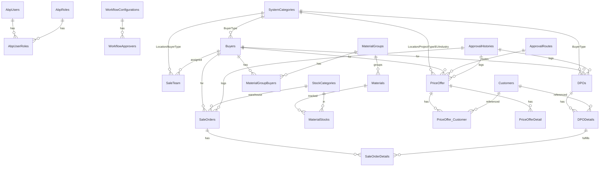

# MEVN.FA.WF2025 — Database Schema (Custom Build)

> Hệ thống tập trung vào **xin giá** và **duyệt giá** (Price Offer + Approval Workflow).
> Tài liệu đã rà soát, **bỏ các trường lưu trữ giấy tờ / file / SAP integration / GIC chuyên biệt** — chỉ giữ trường nghiệp vụ cốt lõi.
>
> **Quy ước ký hiệu:**
> - 🔑 PK — Primary Key
> - 🔗 FK — Foreign Key
> - ⚠️ — Đã đơn giản hoá so với code gốc
> - ❌ — Đã bỏ

---

## 📑 Mục lục

1. [User & Role](#1-user--role)
2. [Workflow Configuration](#2-workflow-configuration)
3. [Approval (Route & History)](#3-approval-route--history)
4. [Master Data](#4-master-data)
5. [Sales Team](#5-sales-team)
6. [Material](#6-material)
7. [Stock (đơn giản)](#7-stock-đơn-giản)
8. [Customer](#8-customer)
9. [Price Offer (trọng tâm)](#9-price-offer-trọng-tâm)
10. [Sale Order (đơn giản)](#10-sale-order-đơn-giản)
11. [DPO (đơn giản)](#11-dpo-đơn-giản)
12. [Bảng & trường đã bỏ](#-bảng--trường-đã-bỏ)
13. [Sơ đồ quan hệ](#-sơ-đồ-quan-hệ)

---

## 1. User & Role

> Dùng module Identity của ABP (có sẵn).

### `AbpUsers`
| Cột | Kiểu | Note |
|---|---|---|
| 🔑 `Id` | Guid | |
| `UserName` | nvarchar | unique |
| `Name`, `Surname` | nvarchar | |
| `Email` | nvarchar | |
| `IsActive` | bit | |

### `AbpRoles`
| Cột | Kiểu | Note |
|---|---|---|
| 🔑 `Id` | Guid | |
| `Name` | nvarchar | unique |

### `AbpUserRoles`
| Cột | Kiểu | Note |
|---|---|---|
| 🔗 `UserId` | Guid | → `AbpUsers.Id` |
| 🔗 `RoleId` | Guid | → `AbpRoles.Id` |
| 🔑 (composite) | | (`UserId`, `RoleId`) |

---

## 2. Workflow Configuration

### `WorkflowConfigurations`
| Cột | Kiểu | Note |
|---|---|---|
| 🔑 `Id` | Guid | |
| `WorkflowType` | nvarchar(50) | vd `PriceOffer`, `MaterialStock`, `DPO` |
| `WorkflowLevel` | smallint | cấp duyệt 1, 2, 3… |
| `WorkflowRole` | nvarchar | role được duyệt |
| `Condition` | nvarchar? | điều kiện áp dụng (vd theo amount) |
| `Note` | nvarchar? | |

### `WorkflowApprovers`
| Cột | Kiểu | Note |
|---|---|---|
| 🔑 `Id` | Guid | |
| 🔗 `WFId` | Guid | → `WorkflowConfigurations.Id` |
| `Approver` | nvarchar | username người duyệt |

---

## 3. Approval (Route & History)

> Dùng TPH inheritance — 1 bảng cha + FK riêng cho từng entity.

### `ApprovalRoutes` *(cha)*
| Cột | Kiểu | Note |
|---|---|---|
| 🔑 `Id` | Guid | |
| `EntityType` | nvarchar | discriminator (`PriceOffer`, `DPO`…) |
| `InstanceId` | Guid? | id entity được duyệt |
| `StepSequence` | int | |
| `Approver` | nvarchar | |
| `ApproverRoleCode`, `ApproverRoleName` | nvarchar | |
| `IsApproved` | bit | |
| `ApprovalDate` | datetime? | |
| `Notes` | nvarchar? | |

**Class con (cùng bảng):**
- `PriceOfferApprovalRoute` — thêm 🔗 `PriceOfferId`

### `ApprovalHistories` *(cha)*
| Cột | Kiểu | Note |
|---|---|---|
| 🔑 `Id` | Guid | |
| `EntityType` | nvarchar | discriminator |
| `Action` | nvarchar | Submitted/Approved/Rejected/Cancelled |
| `ActionDate` | datetime | |
| `ApproverUsername`, `ApproverFullName` | nvarchar? | |
| `ApproverRoleCode`, `ApproverRoleName` | nvarchar? | |
| `IsLastApprovalInCurrentWorkflow` | bit | |
| `Note` | nvarchar? | |

**Class con (cùng bảng):**
- `PriceOfferApprovalHistory` — thêm 🔗 `PriceOfferId`
- `PriceOfferDetailApprovalHistory` — thêm 🔗 `PriceOfferDetailId`
- `DPOApprovalHistory` — thêm 🔗 `DPOId`
- `SOHistory` — thêm 🔗 `SOId`

---

## 4. Master Data

### `SystemCategories` — lookup chung
> Phân biệt qua `CategoryType`: `Location`, `BuyerType`, `Material_Group`, `Material_Type`, `Currency`, `Project_Type`, `EU_Industry`, `Customer_Type`…

| Cột | Kiểu | Note |
|---|---|---|
| 🔑 `Id` | Guid | |
| 🔗 `ParentId` | Guid? | → `SystemCategories.Id` (self) |
| `Code` | nvarchar(50) | |
| `Description` | nvarchar | |
| `CategoryType` | nvarchar(50) | discriminator |
| `SortOrder` | int | |
| `IsDeactive` | bit | |

### `MaterialGroups`
| Cột | Kiểu | Note |
|---|---|---|
| 🔑 `Id` | Guid | |
| `Code` | nvarchar | |
| `Name` | nvarchar | |
| 🔗 `Parent` | Guid? | → `MaterialGroups.Id` (self) |
| `MaterialType` | nvarchar? | |
| `IsDeActive` | bit | |

### `Buyers` *(khách buôn — Distributor/Dealer)*
| Cột | Kiểu | Note |
|---|---|---|
| 🔑 `Id` | Guid | |
| 🔗 `BuyerTypeId` | Guid | → `SystemCategories.Id` |
| `BuyerCode` | nvarchar | |
| `ShortName`, `FullName` | nvarchar? | |
| `TaxCode`, `Address` | nvarchar? | |
| `ContactPerson`, `ContactEmail`, `ContactPhoneNumber` | nvarchar? | |
| `Deactive` | bit? | |

### `MaterialGroupBuyers` *(mapping nhóm vật tư ↔ buyer)*
| Cột | Kiểu | Note |
|---|---|---|
| 🔑 `Id` | Guid | |
| 🔗 `MaterialGroupId` | Guid? | → `MaterialGroups.Id` |
| 🔗 `BuyerId` | Guid | → `Buyers.Id` |

---

## 5. Sales Team

### `SaleTeam`
| Cột | Kiểu | Note |
|---|---|---|
| 🔑 `Id` | Guid | |
| `SaleUserName` | nvarchar | |
| `SaleFullName` | nvarchar? | |
| `MaterialType` | nvarchar | |
| 🔗 `LocationId` | Guid | → `SystemCategories.Id` |
| 🔗 `BuyerId` | Guid | → `Buyers.Id` |
| 🔗 `BuyerTypeId` | Guid | → `SystemCategories.Id` |

---

## 6. Material

### `Materials`
| Cột | Kiểu | Note |
|---|---|---|
| 🔑 `Id` | Guid | |
| `GolfaCode` | nvarchar | unique key nghiệp vụ |
| `Model` | nvarchar | |
| `Description` | nvarchar? | mô tả |
| `Spec1`, `Spec2` | nvarchar? | thông số chính |
| `MaterialType` | nvarchar? | |
| 🔗 `MaterialGroupId` | Guid? | → `MaterialGroups.Id` |
| `Unit` | nvarchar? | ĐVT |
| `VAT` | decimal? | |
| `Input_Price` | decimal? | giá đầu vào |
| `InputCurrency` | nvarchar? | |
| `LandedCost` | decimal? | giá vốn |
| `Standard_Price` | decimal | giá chuẩn |
| `MaxSalesOfferPrice` | decimal? | giá tối đa sales được offer |
| `MaxMangerOfferPrice` | decimal? | giá tối đa manager được offer |
| `MaterialStatus` | nvarchar | |
| `ValidFrom`, `ValidTo` | datetime? | |

---

## 7. Stock (đơn giản)

### `StockCategories`
| Cột | Kiểu | Note |
|---|---|---|
| 🔑 `Id` | Guid | |
| `StockCode` | nvarchar | |
| `StockName` | nvarchar | |
| `IsDeactive` | bit? | |

### `MaterialStocks`
| Cột | Kiểu | Note |
|---|---|---|
| 🔑 `Id` | Guid | |
| 🔗 `MaterialId` | Guid | → `Materials.Id` |
| 🔗 `StockCategoryId` | Guid | → `StockCategories.Id` |
| `Qty` | int? | tồn |
| `Locked` | int? | đang khoá |
| `Available_Qty` | int? | sẵn dùng |

---

## 8. Customer

### `Customers`
| Cột | Kiểu | Note |
|---|---|---|
| 🔑 `Id` | Guid | |
| `TaxCode` | nvarchar | |
| `CustomerName` | nvarchar? | |
| `CustomerType` | nvarchar? | |
| `CustomerIndustry` | nvarchar? | |
| `Country`, `Province` | nvarchar? | |
| `IsDeactive` | bit | |

---

## 9. Price Offer (trọng tâm)

### `PriceOffer`
| Cột | Kiểu | Note |
|---|---|---|
| 🔑 `Id` | Guid | |
| `PriceOfferCode` | nvarchar | unique |
| `MaterialType` | nvarchar | |
| `ApprovalStatus` | nvarchar | Draft/Verifying/InProgress/Approved/Rejected/Cancelled/Closed |
| 🔗 `BuyerId` | Guid? | → `Buyers.Id` |
| 🔗 `BuyerTypeId` | Guid? | → `SystemCategories.Id` |
| 🔗 `LocationId` | Guid? | → `SystemCategories.Id` |
| `ProjectName` | nvarchar? | |
| 🔗 `ProjectTypeId` | Guid? | → `SystemCategories.Id` |
| 🔗 `EUIndustryId` | Guid? | → `SystemCategories.Id` |
| `Country`, `Province` | nvarchar? | |
| `CompetitorBrand` | nvarchar? | |
| `POPlannedDate`, `DeliveryDate`, `CloseDate` | datetime? | |
| `TotalMEVNOfferAmount` | decimal | tổng giá đề xuất |
| `TotalStandardAmount` | decimal | tổng giá chuẩn |
| `TotalPriceToCustomer` | decimal | tổng giá bán cho KH |
| `DiscountRatio` | decimal? | tỷ lệ chiết khấu |
| `ProjectResultStatus` | nvarchar? | Won/Lost/Pending/PreOrder |
| `ProjectResultNote` | nvarchar? | |
| `Note` | nvarchar? | |
| `CurrentApprovalStepSequence` | int? | bước duyệt hiện tại |
| `CurrentApproverRoleCode` | nvarchar? | |

### `PriceOffer_Customer`
| Cột | Kiểu | Note |
|---|---|---|
| 🔑 `Id` | Guid | |
| 🔗 `PriceOfferId` | Guid | → `PriceOffer.Id` |
| 🔗 `CustomerId` | Guid | → `Customers.Id` |
| `SaleChannel` | nvarchar | |

### `PriceOfferDetail`
| Cột | Kiểu | Note |
|---|---|---|
| 🔑 `Id` | Guid | |
| 🔗 `PriceOfferId` | Guid | → `PriceOffer.Id` |
| `RowNo` | int | |
| `GolfaCode` | nvarchar | indexed |
| `ModelName` | nvarchar | |
| `Qty` | decimal | |
| `StandardPrice` | decimal | giá chuẩn |
| `MEVNOfferPrice` | decimal | giá đề xuất |
| `PriceToCustomer` | decimal? | giá bán KH |
| `RequestedDiscountRatio` | decimal? | |
| `LandingCost` | decimal? | |
| `PriceOfferDetailMargin` | decimal? | margin |
| `CompetitorBrand`, `CompetitorModel` | nvarchar? | |
| `CompetitorPrice` | decimal? | |
| `Status` | nvarchar? | |
| `Note` | nvarchar? | |

---

## 10. Sale Order (đơn giản)

### `SaleOrders`
| Cột | Kiểu | Note |
|---|---|---|
| 🔑 `Id` | Guid | |
| `SONo` | nvarchar | |
| `MaterialType` | nvarchar? | |
| 🔗 `BuyerId` | Guid? | → `Buyers.Id` |
| `OrderDate` | datetime? | |
| `StatusCode` | nvarchar? | |
| 🔗 `StockCategoryId` | Guid? | → `StockCategories.Id` |
| `SO_VAT` | decimal? | |
| `IsDeleted` | bit | |

### `SaleOrderDetails`
| Cột | Kiểu | Note |
|---|---|---|
| 🔑 `Id` | Guid | |
| 🔗 `SaleOrderId` | Guid | → `SaleOrders.Id` |
| 🔗 `DPODetailId` | Guid? | → `DPODetails.Id` |
| `GolfaCode` | nvarchar? | |
| `Qty` | int? | |
| `Price`, `Amount`, `VAT` | decimal? | |
| `StatusCode` | nvarchar? | |
| `IsDeleted` | bit | |

---

## 11. DPO (đơn giản)

### `DPOs`
| Cột | Kiểu | Note |
|---|---|---|
| 🔑 `Id` | Guid | |
| `DPONo` | nvarchar? | |
| `Status` | nvarchar? | |
| `MaterialType` | nvarchar? | |
| 🔗 `BuyerId` | Guid? | → `Buyers.Id` |
| 🔗 `BuyerTypeId` | Guid? | → `SystemCategories.Id` |
| `OrderDate` | datetime? | |
| `TotalAmount` | decimal | |
| `CurrentApprovalStepSequence` | int? | |
| `CurrentApproverRoleCode` | nvarchar? | |
| `Note` | nvarchar? | |

### `DPODetails`
| Cột | Kiểu | Note |
|---|---|---|
| 🔑 `Id` | Guid | |
| 🔗 `DPOId` | Guid | → `DPOs.Id` |
| `RowNo` | int? | |
| `GolfaCode` | nvarchar | |
| `Qty` | int? | |
| `UnitPrice`, `Amount` | decimal? | |
| `Delivered`, `NeedDelivery` | int? | |
| 🔗 `CustomerId` | Guid? | → `Customers.Id` |
| `Status` | nvarchar? | |
| `Note` | nvarchar? | |

---

## ❌ Bảng & trường đã bỏ

### 🗑️ Bảng đã bỏ hoàn toàn

| Nhóm | Bảng |
|---|---|
| Lưu trữ file / giấy tờ | `Attachments`, `PriceOfferAttachment`, `FileDescriptors` (nếu có) |
| Supplier (theo yêu cầu) | `Suppliers`, `SupplierBUs` |
| Tin nhắn / chat | `Messages`, `PriceOfferMessage`, `DPOMessage` |
| SPO (đã bỏ trước) | `SpecialInputPrices`, `SpecialInputPriceDetails`, `SpoBatchRequests`, `SpoBatchRequestDetails` |
| Stock Import (đã bỏ) | `StockImports`, `StockImportDetails` |
| Stock advanced lock | `MaterialStockLockShipments`, `MaterialStockLockStocks` |
| GIC / GKR chuyên biệt | `DpoGkrUsages`, `GICApprovalHistory`, `GKRApprovalHistory`, `GICDetailApprovalHistory`, `GKRDetailApprovalHistory`, `GKRApprovalRoute` |
| Material approval | `MaterialApprovalRequests`, `MaterialApprovalRequestDetails`, `MaterialHistories` |
| Tracking lịch sử | `HistoryTrackings`, `MaterialHistoryTrackings`, `StockHistoryTrackings`, `AddMoreItemHistories` |
| Key Account | `KeyAccounts`, `KeyAccountEvaluations`, `CustomerPICs` |
| PSI | `PSIs`, `PSIDetails` |
| Cargo | `Cargos`, `CargoDatas` |
| Stock Tracing | `StockTracings`, `StockTracingDetails` |
| Asset | `Assets`, `AssetRequests`, `AssetRequestDetails` |
| Distributor Target | `DistributorTargets` |
| Purchase Order | `PurchaseOrders`, `PurchaseOrderDetails`, `PurchaseOrderLockShipments`, `PurchaseOrdersSapImports` |
| Stock Upload | `MaterialStockUploads`, `MaterialStockUploadDetails`, `StockImportAllocations`, `StockImportPriorities` |
| SO SAP Import | `SaleOrdersSapImports` |
| System Config động | `SystemConfigurations` |
| Khác | `CfgDiscountRatios` |

### ✂️ Trường đã bỏ trong bảng giữ lại

| Bảng | Trường bỏ | Lý do |
|---|---|---|
| `PriceOffer` | `FileName`, `LocationOld`, `Application`, `DetailedAddress`, `PriceGapWithCompetitor`, `DecisionRight`, `UpcomingPotentialProjects`, `OtherPJInformation`, `AccountNo`, `KeyAccount*` (5 cột), `SpecialInputPrice*` (7 cột), `LastApprovalRouteCreator*` (4 cột), `BuyerTypeDescription`, `ProjectTypeDescription`, `EUIndustryDescription`, `LocationDescription`, `KeyAccountTypeDescription`, `KeyAccountClassDescription`, `BuyerCode`, `ProjectResultSubmitter*` (3 cột), `ProjectResultSubmittedAt`, `HasDPOUsed`, `TotalMarginIssues`, `TotalRequestedAmount`, `InitialTotalMEVNOfferAmount`, `DiscountRatioConfigured`, `CurrentApprovalRouteInstanceId`, `CurrentApproverRoleName` | Lưu trữ giấy tờ, denormalization, KeyAccount, SPO |
| `PriceOfferDetail` | `SpecialSpec1`, `SpecialSpec2`, `DpoUsed`, `BuyerPrice`, `RequestedAmount`, `StandardAmount`, `InputPrice`, `InputCurrency`, `ManagerMargin`, `AccountCode`, `MaxSalesOfferPrice`, `MaxMangerOfferPrice`, `ActualDiscountRatio`, `ImportGuid` | Tinh chỉnh giá / import file |
| `PriceOffer_Customer` | `SaleChannelNumber`, `CustomerTaxCode`, `CustomerName`, `CustomerAddress`, `CustomerNationality`, `CustomerType`, `CustomerIndustry`, `Note` | Đã có FK → `Customers` lấy thông tin |
| `SaleOrder` | `SOSAPNo`, `SAPDONo`, `SAPInvoice`, `SAPBillingNo`, `SAPDeliveryDate`, `SAPInvoiceDate`, `DeliveryConfirmed`, `CompletelyClosed`, `SOType`, `GICType`, `GICProcess`, `GICGivNo`, `GICGivDate`, `BuyerType`, `BuyerCode`, `BuyerName`, `Note` | SAP integration, GIC chuyên biệt |
| `SaleOrderDetail` | `SAPLandingCost`, `SAPAmountLandingCost`, `GICPorNo`, `GICPrNo`, `GICSalePIC`, `GICLocation`, `GICReservationNo`, `GICGivNo`, `GICGivDate`, `ChangeNote`, `Disposed`, `LockStockId`, `Extrafee`, `AmountIncludeExtrafee`, `Extrafee_Note`, `StockCategoryId`, `Note` | SAP, GIC, locking |
| `DPOs` | `DPOType`, `GICType`, `GICProcess`, `CostCenter`, `BuyerShortName`, `BuyerTypeDescription`, `ExpirationDate`, `TotalAmountIncludeExtraFee`, `Remark`, `FileName`, `ReferenceDoc`, `ReferenceDocDate`, `LinkedDpoNo`, `LinkedDpoId`, `LinkedNote`, `Reason`, `SalePicUsername`, `SalePicFullName`, `SalePicTeamId`, `CurrentApprovalRouteInstanceId`, `CurrentApproverRoleName` | GIC/GKR, giấy tờ, denormalization |
| `DPODetails` | `SPOId`, `SPOCode`, `Spec1`, `Spec2`, `Model`, `LandedCost`, `AmountIncludeExtraFee`, `RequestedETA`, `CustomerTaxCode`, `CustomerName`, `CustomerType`, `CustomerIndustry`, `LockStock`, `LockStockSO`, `LockShipment`, `OrderReason`, `AccountNo`, `ConfirmNoted`, `ExtrafeeNote`, `Extrafee`, `ExtrafeeUsedInSO`, `ExtrafeeAvailable`, `DamagedProduct`, `ProductSerialNo`, `MEVNSellingInvoiceNo`, `DPOUsed` | SPO, locking, Warranty GIC, denormalization |
| `Materials` | `SAP_Code`, `Spec3`, `Spec4`, `Description_EN`, `Description_VN` *(gộp thành `Description`)*, `Material_SEC_Classification`, `Material_Group` *(thay bằng FK `MaterialGroupId`)*, `SAPMatGroup`, `Product_Hierarchy`, `ProductHierarchyDescription`, `HS_Code`, `ReferenceLeadTime`, `WarrantyTime`, `InventoryCategory`, `Maxlot`, `StockWarning`, **`SupplierBUId`, `SupplierBUCode`, `SupplierCode`, `Factory_Text`**, `INCOTERMS`, `ImportDuty`, `AppliedExchangeRate`, `SellingPrice1..5`, `RegistrationDate`, `EPA`, `MaterialClass`, `Weight`, `Size`, `QRCode`, `CargoNote`, `CountryOfOrigin`, `Note` | Giấy tờ hải quan, denormalization, đặc tính lý-hoá, **bỏ Supplier** |
| `Buyers` | `BuyerTypeCode`, `PaymentTermCode`, `PaymentTermDescription`, `CreditLimit`, `CreditExposure`, `AvailableCredit`, `AppliedPrice`, `Note` | Payment / Credit logic |
| `MaterialGroups` | `Code` đã có, bỏ `SortOrder`, `Note`, `MaterialGroupPSI`, `AllowKeyAccount` | PSI / KA chuyên biệt |
| `MaterialGroupBuyers` | `MaterialGroupCode`, `BuyerShortName`, `Note` | Denormalization |
| `SaleTeam` | `BuyerShortName`, `Note` | Denormalization |
| `Customers` | `CustomerShortName`, `Address`, `Phone`, `Website`, `Note` | Info phụ |
| `MaterialStocks` | `GolfaCode`, `Model`, `LockStockKeeping`, `LockStockSO`, `Note` | Denormalization, locking advanced |
| `StockCategories` | `SAPCode`, `MainStock`, `DamagedStock`, `FOC`, `SortOrder`, `Note` | SAP, attribute chuyên biệt |
| `SystemCategories` | `Value`, `Note` | Hiếm dùng |
| `WorkflowApprovers` | `Note` | |
| `ApprovalRoutes` / `ApprovalHistories` | Giữ y nguyên (đã gọn) | |

---

## 🗺️ Sơ đồ quan hệ

---

## 📊 Tóm tắt số lượng bảng

| Nhóm | Số bảng |
|---|---|
| User & Role | 3 |
| Workflow | 2 |
| Approval (TPH) | 2 |
| Master Data | 4 |
| Sales Team | 1 |
| Material | 1 |
| Stock | 2 |
| Customer | 1 |
| Price Offer | 3 |
| Sale Order | 2 |
| DPO | 2 |
| **Tổng** | **23 bảng** |

> Schema đã được rút gọn tối đa cho luồng nghiệp vụ chính: **xin giá → duyệt giá → tạo SO/DPO**. Có thể bổ sung trường / bảng sau khi cần thiết.

_Generated for project `MEVN.FA.WF2025` — ABP Framework / DDD architecture._
